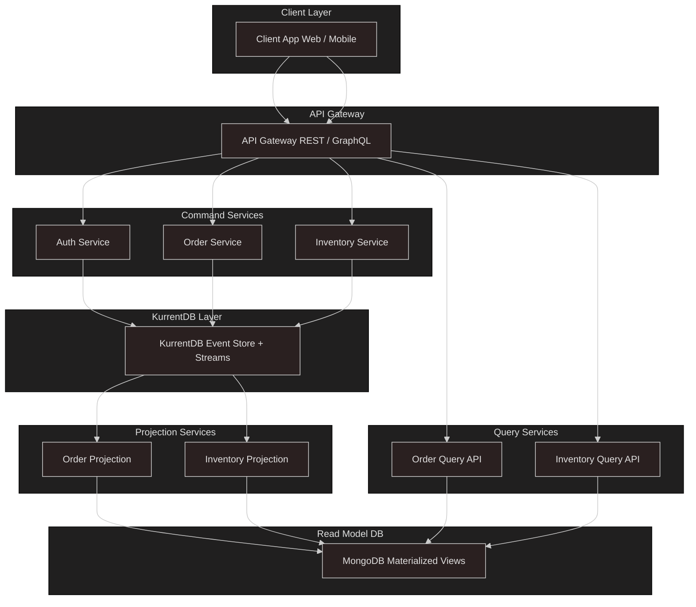

Below is a proposed, best‑practice architecture for a Node.js microservices system that uses event sourcing with KurrentDB as the event store and MongoDB for materialized read models. The design emphasizes loose coupling, scalability, and clear separation of concerns.

## Summary

This architecture splits the system into independent **Command Services** (write side) and **Query Services** (read side), with **KurrentDB** serving as the immutable, append‑only event store and **MongoDB** holding denormalized read models for low‑latency queries. Each microservice is a plain Node.js process (no TypeScript) communicating via events: commands issue writes to KurrentDB, events are projected into MongoDB via dedicated **Projection Services**, and other services consume those projections or subscribe directly to KurrentDB streams. An **API Gateway** fronts the services, while infrastructure concerns (deployment, service discovery, monitoring, and security) are handled through Kubernetes, a service mesh, and centralized logging/metrics.

---

## 1. Core Components

### 1.1 KurrentDB (Event Store)

- **Event‑native database**: Every state change is an immutable event in an append‑only log, with built‑in streams and low‑latency subscriptions ([Kurrent - event-native data platform][1]).
- **Zero‑code outbox**: Ensures atomicity of event persistence and publication without extra tables or glue code ([Kurrent - event-native data platform][2]).
- **Client SDK**: Use the official Node.js SDK in each Command Service to append events and subscribe to streams ([GitHub][3]).

### 1.2 MongoDB (Read Models)

- **Materialized views**: Dedicated Projection Services transform event streams into denormalized MongoDB collections optimized for queries ([Deepal’s Blog][4]).
- **Scalability**: MongoDB’s horizontal sharding handles high read/write workloads independently of the event store ([Event-Driven][5]).

### 1.3 Node.js Microservices

- **Command Services**: Receive client commands (via API Gateway), perform validation/business logic, then append events to KurrentDB ([Modus Create][6]).
- **Projection Services**: Subscribe to KurrentDB streams, build/update MongoDB read models, and emit integration events as needed ([Kurrent Discuss Forum][7]).
- **Query Services**: Serve read requests by querying MongoDB or, for specialized use cases, subscribe directly to KurrentDB streams for temporal queries ([microservices.io][8]).

---

## 2. Event Flow

1. **Client → API Gateway**

   - Routes REST/WebSocket requests to the appropriate Command Service.

2. **Command Service → KurrentDB**

   - Validates commands, applies aggregate logic in memory, appends resulting events via Node.js SDK ([Modus Create][6]).

3. **KurrentDB Streams → Projection Service**

   - Projection Service subscribes to domain streams, processes events in order, updates MongoDB read collections ([Kurrent - event-native data platform][1]).

4. **Projection Service → MongoDB**

   - Writes denormalized read models; optionally publishes integration events for other bounded contexts ([Stack Overflow][9]).

5. **Client ← Query Service**

   - Query Service fetches from MongoDB; for specialized analytics, may subscribe to KurrentDB directly.

---

## 3. Supporting Infrastructure

### 3.1 Deployment & Orchestration

- **Kubernetes**: Host all services (Command, Projection, Query) plus KurrentDB and MongoDB as StatefulSets/Deployments.
- **Helm Charts**: Package each service and database with configurable values for scaling and resilience.

### 3.2 Service Discovery & Networking

- **API Gateway** (e.g., Kong or Envoy): Central ingress, authentication, rate limiting.
- **Service Mesh** (e.g., Istio): mTLS, circuit breaking, observability between microservices.

### 3.3 Observability

- **Centralized Logging**: Fluentd/Logstash → Elasticsearch for logs from Node.js services, KurrentDB, and MongoDB.
- **Metrics & Tracing**: Prometheus + Grafana; OpenTelemetry for distributed tracing across command and projection boundaries.

### 3.4 Security

- **mTLS** in mesh for service‑to‑service encryption.
- **OAuth2/JWT** at the API Gateway for client authentication.
- **RBAC** on Kubernetes to limit access to KurrentDB and MongoDB clusters.

---

## 4. Best Practices & Trade‑offs

| Concern              | Best Practice                                                                                                              | Trade‑off                                 |
| -------------------- | -------------------------------------------------------------------------------------------------------------------------- | ----------------------------------------- |
| **Event Ordering**   | Partition KurrentDB streams by aggregate ID to maintain per‑aggregate ordering ([Kurrent - event-native data platform][1]) | More streams to manage                    |
| **Idempotency**      | Include unique command IDs to dedupe retries at Command Service                                                            | Slightly more metadata per request        |
| **Schema Evolution** | Version events and use upcasters in Projection Services                                                                    | Projections must handle multiple versions |
| **Back‑pressure**    | Use KurrentDB client’s flow control to tune consumption rate                                                               | May increase projection lag under load    |
| **Monitoring Lag**   | Emit metrics for projection lag vs. KurrentDB head                                                                         | Added instrumentation complexity          |

---

## 5. When to Adapt

- **High‑throughput writes**: Scale KurrentDB clusters horizontally and shard streams; MongoDB scales independently.
- **Complex read patterns**: Add additional Projection Services that write to specialized stores (Elasticsearch, Redis).
- **Cross‑service transactions**: Use Sagas or orchestration patterns built on KurrentDB events rather than two‑phase commits.

---

This architecture provides a robust, scalable foundation for Node.js microservices leveraging event sourcing with KurrentDB as the single source of truth and MongoDB for fast reads, all orchestrated through Kubernetes and enhanced with service mesh observability.

---

[1]: https://www.kurrent.io/event-sourcing?utm_source=chatgpt.com "Beginner's Guide to Event Sourcing - Kurrent"
[2]: https://www.kurrent.io/?utm_source=chatgpt.com "Kurrent - event-native data platform"
[3]: https://github.com/kurrent-io/KurrentDB?utm_source=chatgpt.com "kurrent-io/KurrentDB: KurrentDB, the event-native ... - GitHub"
[4]: https://blog.insiderattack.net/implementing-event-sourcing-and-cqrs-pattern-with-mongodb-66991e7b72be?utm_source=chatgpt.com "Implementing Event Sourcing and CQRS pattern with MongoDB"
[5]: https://event-driven.io/en/mongodb_event_store/?utm_source=chatgpt.com "How to build MongoDB Event Store - Event-Driven.io"
[6]: https://moduscreate.com/blog/understanding-microservices-with-an-event-driven-approach/?utm_source=chatgpt.com "Understanding Microservices with an Event-Driven Node.js Project"
[7]: https://discuss.kurrent.io/t/could-someone-give-me-advice-for-scaling-event-store-in-a-microservices-architecture/5435?utm_source=chatgpt.com "Could Someone Give me Advice for Scaling Event Store in a ..."
[8]: https://microservices.io/patterns/data/event-sourcing.html?utm_source=chatgpt.com "Pattern: Event sourcing - Microservices.io"
[9]: https://stackoverflow.com/questions/55353966/best-practices-for-micro-service-interaction-with-event-sourcing-cqrs?utm_source=chatgpt.com "Best Practices for Micro-service interaction with Event-Sourcing ..."
